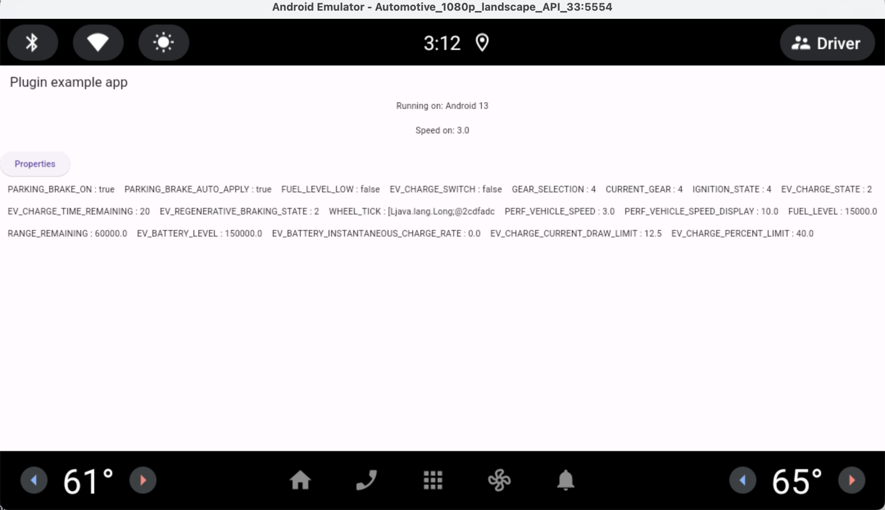

# flutter_aaos

Android Automotive OS plugin

## How to use

### Run on emulator

1. Open Android studio
2. Tools -> SDK Manager: download Android 13 or any version with Android Automotive
3. Tools -> Device Mnager: Add Device -> Select Hardware Automotive ...

### Code Sample

```dart
final _flutterAaosPlugin = FlutterAaos();
getCarData() async {
    // list all available properties 
    carData = await _flutterAaosPlugin.propertyList;

    for (var item in carData!) {
      int id = item["id"];
      // listen to the property value change
      Stream s = await _flutterAaosPlugin.listenProperty(id);
      s.listen((event) {
        setState(() {
          item["value"] = event.toString();
        });
      });
    }
  }
```



